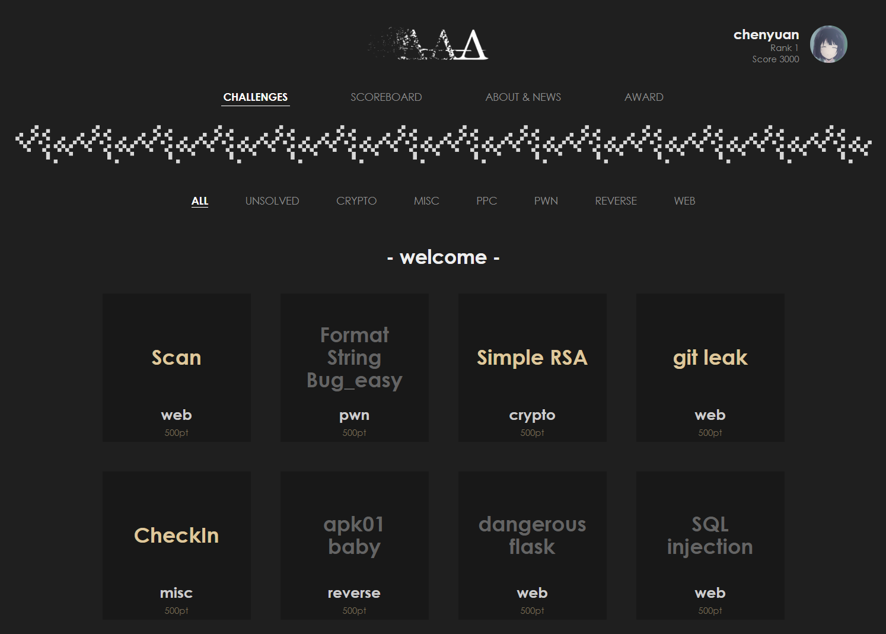
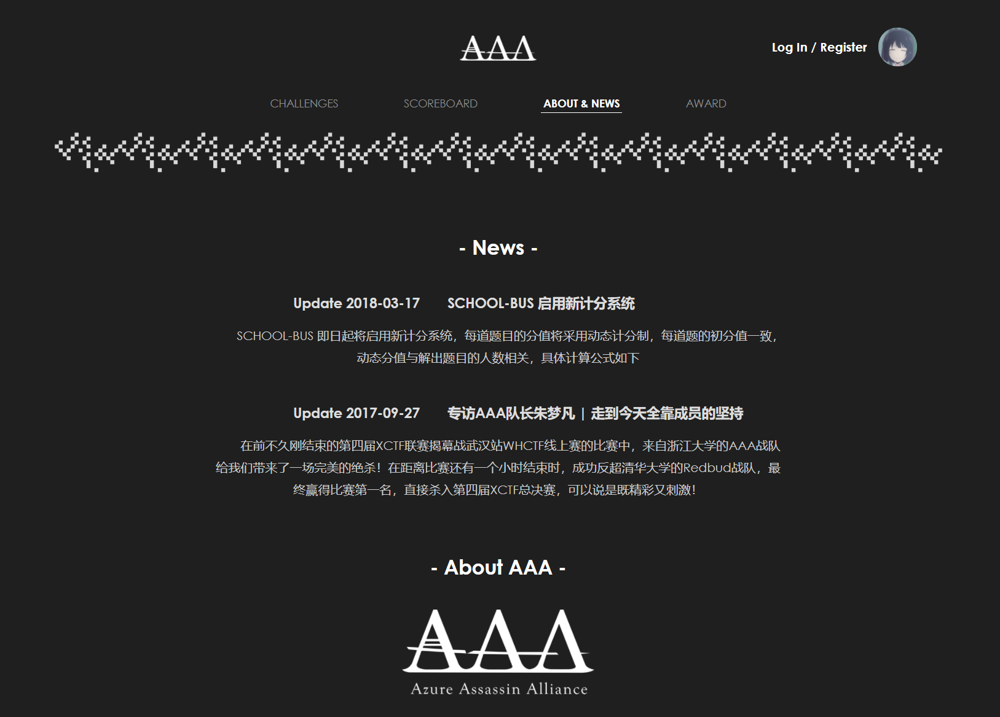

# [School-Bus]

__浙江大学AAA战队CTF练习平台前端 V2__

### What is 'AAA' ?

AAA (Azure Assassin Alliance) 战队是由浙江大学信息安全爱好者自发组织，
浙江大学计算机学院支持建立的团队，队伍中每一位成员都对信息安全有无与伦比的热爱，
因此对 CTF 比赛总是充满了激情

### What is 'School-Bus' ?

'School-Bus' 是一个面向所有 __ZJU__ 学生开放的 CTF 练习平台，
同学们能够在这个平台上学习和训练自己各方面的 Hacking 技能，
本平台将涵盖 Pwnable, Reverse, Web, Crypto, Misc, Program 等全类型的题目，
我们将会持续更新，同时对于表现出色的同学也会给予一定的奖励

### Portal

[https://zjusec.com/](https://zjusec.com/)

### Preview

### Technology stack

__框架__
- __vue__
- vue-router
- vuex

__模板/预处理器__
- pug
- stylus

__构建__
- __webpack__

__依赖管理__
- yarn

### Join Us

欢迎加入我们！
有任何BUG和意见都可以向我们反馈

### Contact

- __admin:__  AAA (aaa.zju#gmail)
- __QQ Group:__ 完成任意一道 'Welcome' 类的题目，群号就在 flag 中
- Just contact with me
